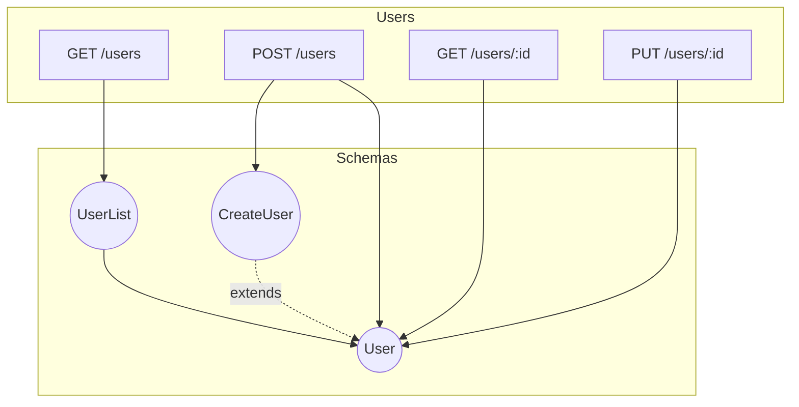

# CLI Enhancement Roadmap

This document outlines the planned CLI enhancements for express-swagger-auto, prioritized by implementation phase.

## Phase 7.1: Quick Wins (v0.3.1)

Target: Low effort, high impact features that improve developer experience immediately.

---

### `stats` Command

**Purpose:** Provide comprehensive statistics about an OpenAPI specification.

**Value:** Quality metrics, documentation completeness tracking, governance dashboards.

**Complexity:** Low

**Usage:**
```bash
express-swagger-auto stats [specPath] [options]
```

**Options:**
| Option | Description | Default |
|--------|-------------|---------|
| `--format` | Output format (text\|json\|markdown) | `text` |
| `--ci` | CI mode with structured output | `false` |

**Output Metrics:**
- **Operations:** Total count, by method (GET, POST, PUT, DELETE, PATCH)
- **Paths:** Total unique paths, nested depth analysis
- **Schemas:** Component schemas count, referenced vs inline
- **Parameters:** Path, query, header, cookie counts
- **Security:** Coverage percentage, schemes used
- **Documentation:** Description/summary coverage percentage
- **Tags:** Distribution and usage

**Example Output:**
```
📊 API Statistics: My API v1.0.0

Operations
  Total:     42
  GET:       18 (43%)
  POST:      12 (29%)
  PUT:       6  (14%)
  DELETE:    4  (10%)
  PATCH:     2  (5%)

Paths
  Total:     28
  Max Depth: 4

Schemas
  Components:  15
  Inline:      8

Documentation Coverage
  Summaries:     95% (40/42)
  Descriptions:  78% (33/42)
  Examples:      45% (19/42)

Security
  Coverage:  85% (36/42 operations)
  Schemes:   Bearer, API Key

Tags
  users:     12 operations
  products:  10 operations
  orders:    8 operations
  auth:      6 operations
  admin:     6 operations
```

**JSON Output:**
```json
{
  "title": "My API",
  "version": "1.0.0",
  "operations": {
    "total": 42,
    "byMethod": { "get": 18, "post": 12, "put": 6, "delete": 4, "patch": 2 }
  },
  "paths": { "total": 28, "maxDepth": 4 },
  "schemas": { "components": 15, "inline": 8 },
  "documentation": {
    "summaries": { "count": 40, "total": 42, "percentage": 95 },
    "descriptions": { "count": 33, "total": 42, "percentage": 78 },
    "examples": { "count": 19, "total": 42, "percentage": 45 }
  },
  "security": {
    "coverage": 85,
    "protectedOperations": 36,
    "totalOperations": 42,
    "schemes": ["bearer", "apiKey"]
  },
  "tags": { "users": 12, "products": 10, "orders": 8, "auth": 6, "admin": 6 }
}
```

---

### Shell Completion

**Purpose:** Auto-completion for bash, zsh, fish, and PowerShell.

**Value:** Improved developer experience, command discoverability, reduced typos.

**Complexity:** Low

**Usage:**
```bash
express-swagger-auto completion [shell]
```

**Supported Shells:**
- `bash` - Bash completion script
- `zsh` - Zsh completion script  
- `fish` - Fish completion script
- `powershell` - PowerShell completion script

**Installation Examples:**

**Bash:**
```bash
express-swagger-auto completion bash >> ~/.bashrc
source ~/.bashrc
```

**Zsh:**
```bash
express-swagger-auto completion zsh >> ~/.zshrc
source ~/.zshrc
```

**Fish:**
```bash
express-swagger-auto completion fish > ~/.config/fish/completions/express-swagger-auto.fish
```

**PowerShell:**
```powershell
express-swagger-auto completion powershell >> $PROFILE
. $PROFILE
```

**Implementation:** Use Commander.js built-in completion or [tabtab](https://github.com/mklabs/tabtab) package.

---

### Extended Output Formats

**Purpose:** Additional output formats for better CI/CD and tooling integration.

**Value:** IDE integration, CI tool compatibility, reporting dashboards.

**Complexity:** Low

**New Formats:**

| Format | Description | Use Case |
|--------|-------------|----------|
| `checkstyle` | XML format | Jenkins, static analysis tools |
| `junit` | JUnit XML | Test runners, CI dashboards |
| `stylish` | Condensed terminal | Terminal output |
| `github-actions` | GitHub annotations | PR annotations |
| `codeclimate` | Code Climate JSON | Quality tracking |
| `markdown` | Markdown table | PR comments, docs |

**Usage:**
```bash
express-swagger-auto validate ./openapi.yaml --ci --ci-format github-actions
express-swagger-auto validate ./openapi.yaml --ci --ci-format junit > report.xml
express-swagger-auto validate ./openapi.yaml --ci --ci-format checkstyle > checkstyle.xml
```

**GitHub Actions Format Example:**
```
::error file=openapi.yaml,line=45,col=12::Missing required field: operationId
::warning file=openapi.yaml,line=67,col=8::Operation lacks description
```

---

## Phase 7.2: API Governance (v0.4.0)

Target: Medium effort features for API governance and versioning workflows.

---

### `diff` Command

**Purpose:** Compare two OpenAPI specs to detect breaking changes, additions, and deprecations.

**Value:** API versioning, backward compatibility guarantees, migration planning, CI/CD gates.

**Complexity:** Medium

**Approach:** Hybrid - Use existing diff libraries where suitable, build Express-specific insights for middleware and route pattern analysis.

**Usage:**
```bash
express-swagger-auto diff <source> <target> [options]
```

**Arguments:**
| Argument | Description |
|----------|-------------|
| `<source>` | Base/old OpenAPI spec file |
| `<target>` | New/updated OpenAPI spec file |

**Options:**
| Option | Description | Default |
|--------|-------------|---------|
| `--fail-on-breaking` | Exit with error on breaking changes | `false` |
| `--fail-on-any` | Exit with error on any changes | `false` |
| `--format` | Output format (text\|json\|markdown) | `text` |
| `--breaking-only` | Show only breaking changes | `false` |
| `--ci` | CI mode with structured output | `false` |

**Change Categories:**

1. **Breaking Changes** (🔴)
   - Removed endpoints
   - Removed required parameters
   - Changed parameter types (incompatible)
   - Narrowed response types
   - Removed response status codes
   - Changed authentication requirements

2. **Non-Breaking Changes** (🟢)
   - Added endpoints
   - Added optional parameters
   - Added response properties
   - Added response status codes
   - Widened parameter types

3. **Deprecations** (🟡)
   - Deprecated endpoints
   - Deprecated parameters
   - Deprecated schemas

**Example Output:**
```
🔄 API Diff: v1.0.0 → v2.0.0

🔴 Breaking Changes (3)
  • DELETE /api/users/{id}
    Endpoint removed
  
  • POST /api/orders
    Required parameter added: customerId (query)
  
  • GET /api/products
    Response property removed: legacyId

🟢 Non-Breaking Changes (5)
  • POST /api/webhooks
    New endpoint added
  
  • GET /api/users
    Optional parameter added: sortBy (query)
  
  • GET /api/orders/{id}
    Response property added: tracking

🟡 Deprecations (1)
  • GET /api/legacy/products
    Endpoint deprecated

Summary: 3 breaking, 5 non-breaking, 1 deprecation
```

**Express-Specific Insights:**
- Middleware changes detection
- Route pattern evolution (e.g., `/users/:id` → `/users/{userId}`)
- Security middleware changes
- Rate limiting changes

---

### `lint` Command

**Purpose:** Advanced linting with configurable rules (subset of Spectral features).

**Value:** API governance, style guide enforcement, consistent API design.

**Complexity:** Medium-High

**Design Principle:** Implement subset without breaking existing validation. Extend, don't replace.

**Usage:**
```bash
express-swagger-auto lint [specPath] [options]
```

**Options:**
| Option | Description | Default |
|--------|-------------|---------|
| `--ruleset` | Built-in ruleset (recommended\|minimal\|strict) | `recommended` |
| `--config` | Custom ruleset file path | Auto-detected |
| `--format` | Output format | `stylish` |
| `--fail-severity` | Fail on severity level (error\|warn) | `error` |
| `--ignore` | Paths to ignore (glob patterns) | None |

**Built-in Rulesets:**

**`minimal`** - Essential checks only:
- Valid OpenAPI structure
- Required fields present
- Valid $ref references

**`recommended`** - Best practices:
- All operations have operationId
- All operations have summary
- All operations have tags
- Response schemas defined
- Parameters have descriptions
- No unused schemas

**`strict`** - Full governance:
- All recommended rules
- All operations have description
- All parameters have examples
- All schemas have descriptions
- Security defined on all operations
- No inline schemas (use $ref)

**Express-Specific Rules:**
- `express/consistent-path-params` - Path parameters match Express conventions
- `express/middleware-documented` - Middleware effects documented
- `express/error-responses` - Error responses follow Express patterns

**Custom Ruleset File (`.swagger-auto-lint.yaml`):**
```yaml
extends: recommended

rules:
  operation-operationId: error
  operation-summary: warn
  operation-description: off
  
  # Express-specific
  express/consistent-path-params: error
  express/error-responses: warn
```

**Example Output (stylish):**
```
openapi.yaml
  45:12  error    Missing operationId           operation-operationId
  67:8   warning  Missing operation description operation-description
  89:4   error    Unused schema: LegacyUser     no-unused-schemas

✖ 3 problems (2 errors, 1 warning)
```

---

## Phase 7.3: Advanced Workflows (v0.5.0)

Target: High effort features for advanced API development workflows.

---

### `bundle` Command

**Purpose:** Combine multi-file API descriptions into a single file with $ref resolution.

**Value:** Large API management, team collaboration, tooling compatibility.

**Complexity:** Medium

**Usage:**
```bash
express-swagger-auto bundle <specPath> [options]
```

**Options:**
| Option | Description | Default |
|--------|-------------|---------|
| `--output` | Output file path | stdout |
| `--format` | Output format (json\|yaml) | Auto from extension |
| `--dereference` | Fully inline all $ref references | `false` |
| `--remove-unused` | Tree shake unused schemas | `false` |
| `--keep-external` | Keep external URL references | `false` |

**Example:**
```bash
# Bundle with dereferencing
express-swagger-auto bundle ./api/openapi.yaml -o ./dist/openapi.yaml --dereference

# Bundle and remove unused schemas
express-swagger-auto bundle ./api/openapi.yaml -o ./dist/openapi.yaml --remove-unused
```

---

### `mock` Command

**Purpose:** Generate a functioning mock server from the OpenAPI spec.

**Value:** Frontend development decoupling, API-first workflows, integration testing.

**Complexity:** High

**Usage:**
```bash
express-swagger-auto mock [specPath] [options]
```

**Options:**
| Option | Description | Default |
|--------|-------------|---------|
| `--port` | Server port | `4010` |
| `--host` | Server host | `localhost` |
| `--delay` | Response delay (ms) | `0` |
| `--validate-request` | Validate incoming requests | `true` |
| `--dynamic` | Generate dynamic responses from schemas | `false` |
| `--cors` | Enable CORS | `true` |

**Features:**
- Serve example responses from spec
- Dynamic response generation from schemas (using Faker.js patterns)
- Request validation against spec
- Configurable response delays for latency simulation
- CORS support for frontend development

**Example:**
```bash
# Basic mock server
express-swagger-auto mock ./openapi.yaml

# With dynamic responses and delay
express-swagger-auto mock ./openapi.yaml --dynamic --delay 200
```

---

### `score` Command

**Purpose:** Calculate an overall API quality score with actionable recommendations.

**Value:** Gamification, quality gates, API governance metrics, continuous improvement.

**Complexity:** Medium

**Usage:**
```bash
express-swagger-auto score [specPath] [options]
```

**Options:**
| Option | Description | Default |
|--------|-------------|---------|
| `--format` | Output format (text\|json) | `text` |
| `--threshold` | Minimum passing score (0-100) | `70` |
| `--fail-below` | Exit with error below threshold | `false` |

**Scoring Categories:**
- **Documentation** (30 points) - Descriptions, summaries, examples
- **Security** (25 points) - Auth schemes, HTTPS, sensitive data handling
- **Consistency** (20 points) - Naming conventions, response patterns
- **Completeness** (15 points) - All operations documented, schemas defined
- **Best Practices** (10 points) - Versioning, pagination, error handling

**Example Output:**
```
🏆 API Quality Score: 78/100 (B+)

Documentation       24/30  ████████░░
  ✓ 95% operations have summaries
  ✗ 45% operations lack examples
  ✓ 78% schemas have descriptions

Security            20/25  ████████░░
  ✓ Bearer authentication defined
  ✓ 85% endpoints have security
  ✗ No rate limiting documented

Consistency         18/20  █████████░
  ✓ Consistent naming conventions
  ✓ Standard error response format
  ✗ Mixed path parameter styles

Completeness        12/15  ████████░░
  ✓ All operations have responses
  ✗ 3 schemas missing from components

Best Practices       4/10  ████░░░░░░
  ✗ No API versioning in paths
  ✗ No pagination on list endpoints
  ✓ Standard HTTP methods used

💡 Recommendations:
  1. Add examples to 23 operations (potential +6 points)
  2. Document rate limiting headers (potential +3 points)
  3. Add API version prefix to paths (potential +4 points)
```

---

### `preview` Command

**Purpose:** Hot-reloading documentation preview server.

**Value:** Documentation authoring workflow, real-time feedback during development.

**Complexity:** Low (extends existing `serve` command)

**Usage:**
```bash
express-swagger-auto preview [specPath] [options]
```

**Options:**
| Option | Description | Default |
|--------|-------------|---------|
| `--port` | Server port | `3000` |
| `--theme` | Documentation theme (swagger\|redoc\|rapidoc) | `swagger` |
| `--watch` | Watch for spec changes | `true` |
| `--open` | Open browser automatically | `true` |

**Features:**
- Multiple documentation renderers (Swagger UI, ReDoc, RapiDoc)
- Live reload on spec changes
- Theme customization
- Auto-open browser

---

## Phase 7.4: Developer Experience (v0.6.0)

### `export` Command

**Purpose:** Export OpenAPI spec to Postman, Insomnia, and other API client formats.

**Value:** Immediate team adoption, bridge to existing workflows, reduces manual import friction.

**Complexity:** Medium

**Usage:**
```bash
express-swagger-auto export [specPath] [options]
```

**Options:**
| Option | Description | Default |
|--------|-------------|---------|
| `--format` | Target format (postman\|insomnia\|bruno\|hoppscotch) | `postman` |
| `--output` | Output file path | `./api-collection.<format>` |
| `--name` | Collection name | Spec title |
| `--env` | Include environment template | `true` |
| `--variables` | Base URL variables (key=value) | `[]` |
| `--group-by` | Grouping strategy (tags\|paths\|none) | `tags` |

**Features:**
- **Postman v2.1 Collection**: Full feature support including tests, variables, auth
- **Insomnia v4**: Workspaces, environments, request groups
- **Bruno**: Git-friendly plain-text format
- **Hoppscotch**: JSON format for web-based testing
- Auto-generate environment templates with variables
- Preserve examples, descriptions, and auth configurations

**Example:**
```bash
# Export to Postman with custom base URL
express-swagger-auto export ./openapi.yaml --format postman --variables baseUrl=http://localhost:3000

# Export to Insomnia with environment
express-swagger-auto export ./openapi.yaml --format insomnia --env --output ./insomnia-workspace.json

# Export all formats at once
express-swagger-auto export ./openapi.yaml --format postman,insomnia,bruno
```

**TypeScript Interface:**
```typescript
interface ExportOptions {
  format: 'postman' | 'insomnia' | 'bruno' | 'hoppscotch';
  output?: string;
  name?: string;
  includeEnv?: boolean;
  variables?: Record<string, string>;
  groupBy?: 'tags' | 'paths' | 'none';
}

interface PostmanCollection {
  info: {
    name: string;
    schema: 'https://schema.getpostman.com/json/collection/v2.1.0/collection.json';
  };
  item: PostmanItem[];
  variable: PostmanVariable[];
  auth?: PostmanAuth;
}
```

---

### `examples` Command

**Purpose:** Generate realistic example values for request/response bodies using Faker.js patterns.

**Value:** Accelerate documentation, improve testing, provide realistic API samples.

**Complexity:** Medium

**Usage:**
```bash
express-swagger-auto examples [specPath] [options]
```

**Options:**
| Option | Description | Default |
|--------|-------------|---------|
| `--output` | Output file path | stdout / inplace |
| `--inplace` | Modify spec file directly | `false` |
| `--locale` | Faker.js locale | `en` |
| `--seed` | Random seed for reproducibility | `undefined` |
| `--count` | Number of example arrays | `3` |
| `--overwrite` | Overwrite existing examples | `false` |

**Smart Field Detection:**
```yaml
# Input schema
properties:
  email:
    type: string
  firstName:
    type: string
  phone:
    type: string
  createdAt:
    type: string
    format: date-time
  avatar:
    type: string
    format: uri

# Generated output (auto-detected by field name)
example:
  email: "john.doe@example.com"
  firstName: "John"
  phone: "+1-555-123-4567"
  createdAt: "2024-01-15T10:30:00Z"
  avatar: "https://avatars.example.com/u/12345.jpg"
```

**Field Pattern Mappings:**
| Pattern | Faker Method |
|---------|-------------|
| `*email*` | `faker.internet.email()` |
| `*name*`, `firstName`, `lastName` | `faker.person.firstName()` / `lastName()` |
| `*phone*` | `faker.phone.number()` |
| `*address*` | `faker.location.streetAddress()` |
| `*url*`, `*uri*`, `*link*` | `faker.internet.url()` |
| `*uuid*`, `*id*` | `faker.string.uuid()` |
| `format: date-time` | `faker.date.recent().toISOString()` |
| `format: date` | `faker.date.recent().toISOString().split('T')[0]` |
| `*price*`, `*amount*` | `faker.finance.amount()` |

**Example:**
```bash
# Preview generated examples
express-swagger-auto examples ./openapi.yaml

# Update spec in place
express-swagger-auto examples ./openapi.yaml --inplace

# Generate with specific locale
express-swagger-auto examples ./openapi.yaml --locale de --output ./openapi-with-examples.yaml
```

---

### `env` Command

**Purpose:** Manage multi-environment API configurations with variable substitution.

**Value:** Simplify environment management, reduce configuration errors, enable environment-specific validation.

**Complexity:** Low

**Usage:**
```bash
express-swagger-auto env [action] [options]
```

**Actions:**
| Action | Description |
|--------|-------------|
| `list` | List all configured environments |
| `show <env>` | Show environment configuration |
| `validate <env>` | Validate spec with environment variables |
| `export <env>` | Export spec with resolved variables |

**Options:**
| Option | Description | Default |
|--------|-------------|---------|
| `--config` | Config file path | `.express-swagger-auto.yaml` |
| `--format` | Output format (yaml\|json) | `yaml` |

**Configuration File:**
```yaml
# .express-swagger-auto.yaml
environments:
  development:
    variables:
      baseUrl: http://localhost:3000
      apiVersion: v1
    servers:
      - url: ${baseUrl}/api/${apiVersion}
        description: Development server
    security:
      apiKey: dev-key-12345
  
  staging:
    variables:
      baseUrl: https://staging-api.example.com
      apiVersion: v1
    servers:
      - url: ${baseUrl}/api/${apiVersion}
        description: Staging server
    security:
      apiKey: ${STAGING_API_KEY}  # From environment variable
  
  production:
    variables:
      baseUrl: https://api.example.com
      apiVersion: v1
    servers:
      - url: ${baseUrl}/api/${apiVersion}
        description: Production server
    security:
      apiKey: ${PROD_API_KEY}
```

**Example:**
```bash
# List environments
express-swagger-auto env list

# Validate with production config
express-swagger-auto env validate production

# Export resolved spec
express-swagger-auto env export staging --output ./openapi-staging.yaml
```

---

## Phase 8: Enterprise Features (v0.7.0)

### `sdk` Command

**Purpose:** Generate TypeScript-first SDK from OpenAPI specification with full type safety.

**Value:** Accelerate API consumption, ensure type safety, reduce integration errors.

**Complexity:** High

**Strategy:** TypeScript-first with optional JavaScript output (user preference)

**Usage:**
```bash
express-swagger-auto sdk [specPath] [options]
```

**Options:**
| Option | Description | Default |
|--------|-------------|---------|
| `--output` | Output directory | `./sdk` |
| `--name` | Package name | `api-client` |
| `--language` | Target language (typescript\|javascript) | `typescript` |
| `--runtime` | HTTP client (fetch\|axios\|ky) | `fetch` |
| `--zod` | Generate Zod schemas for validation | `false` |
| `--react-query` | Generate React Query hooks | `false` |
| `--swr` | Generate SWR hooks | `false` |

**Generated Structure:**
```
sdk/
├── package.json
├── tsconfig.json
├── src/
│   ├── index.ts           # Main exports
│   ├── client.ts          # API client class
│   ├── types.ts           # All TypeScript interfaces
│   ├── schemas.ts         # Zod schemas (optional)
│   ├── operations/        # Per-operation modules
│   │   ├── getUsers.ts
│   │   ├── createUser.ts
│   │   └── ...
│   └── hooks/             # React hooks (optional)
│       ├── useGetUsers.ts
│       └── ...
└── README.md
```

**TypeScript Interface:**
```typescript
interface SDKGeneratorOptions {
  output: string;
  name: string;
  language: 'typescript' | 'javascript';
  runtime: 'fetch' | 'axios' | 'ky';
  includeZod?: boolean;
  includeReactQuery?: boolean;
  includeSWR?: boolean;
}

// Generated client example
interface ApiClient {
  users: {
    list(params?: ListUsersParams): Promise<User[]>;
    get(id: string): Promise<User>;
    create(data: CreateUserRequest): Promise<User>;
    update(id: string, data: UpdateUserRequest): Promise<User>;
    delete(id: string): Promise<void>;
  };
  posts: {
    list(params?: ListPostsParams): Promise<Post[]>;
    // ...
  };
}

// Generated Zod schema example
const UserSchema = z.object({
  id: z.string().uuid(),
  email: z.string().email(),
  name: z.string().min(1).max(100),
  createdAt: z.string().datetime(),
});
```

**Example:**
```bash
# Generate TypeScript SDK with fetch
express-swagger-auto sdk ./openapi.yaml --output ./packages/api-client

# Generate with Zod validation and React Query hooks
express-swagger-auto sdk ./openapi.yaml --zod --react-query --output ./src/api

# Generate JavaScript SDK with axios
express-swagger-auto sdk ./openapi.yaml --language javascript --runtime axios
```

---

### `contract` Command

**Purpose:** Contract testing with snapshot validation for API consistency.

**Value:** Prevent breaking changes, ensure backward compatibility, automate API governance.

**Complexity:** High

**Strategy:** Snapshot-based validation with semantic diff (user preference)

**Usage:**
```bash
express-swagger-auto contract [action] [specPath] [options]
```

**Actions:**
| Action | Description |
|--------|-------------|
| `snapshot` | Create/update baseline snapshot |
| `test` | Test current spec against snapshot |
| `approve` | Approve pending changes |
| `history` | Show contract change history |

**Options:**
| Option | Description | Default |
|--------|-------------|---------|
| `--snapshot-dir` | Snapshot directory | `./.api-snapshots` |
| `--fail-on` | Failure conditions (breaking\|any) | `breaking` |
| `--allow` | Allowed change types | `[]` |
| `--report` | Report format (text\|json\|markdown) | `text` |

**Contract Rules:**
```yaml
# .express-swagger-auto.yaml
contract:
  rules:
    breaking:
      - remove-endpoint       # Removing an endpoint
      - remove-required-param # Making optional param required
      - change-response-type  # Changing response schema type
      - narrow-enum          # Removing enum values
      - change-path          # Changing endpoint path
    
    non-breaking:
      - add-endpoint         # Adding new endpoints
      - add-optional-param   # Adding optional parameters
      - add-response-field   # Adding new response fields
      - widen-enum          # Adding enum values
      - add-security-scheme  # Adding new auth methods
    
    warnings:
      - deprecate-endpoint   # Deprecating endpoints
      - change-description   # Documentation changes
```

**Example Output:**
```
🔍 Contract Test Results

Baseline: v2.1.0 (2024-01-10)
Current:  v2.2.0-dev

Changes Detected: 5

❌ BREAKING (2):
  • DELETE /users/{id}
    Endpoint removed - this will break existing clients
  
  • POST /orders
    Required parameter 'customerId' was optional in baseline

⚠️  WARNINGS (1):
  • GET /products
    Endpoint deprecated - schedule removal in v3.0

✅ NON-BREAKING (2):
  • POST /payments
    New endpoint added
  
  • GET /users/{id}
    New optional field 'preferences' in response

Contract Status: FAILED (2 breaking changes)
```

**TypeScript Interface:**
```typescript
interface ContractTestOptions {
  snapshotDir: string;
  failOn: 'breaking' | 'any';
  allowedChanges?: ChangeType[];
  reportFormat: 'text' | 'json' | 'markdown';
}

interface ContractSnapshot {
  version: string;
  timestamp: string;
  specHash: string;
  endpoints: EndpointSignature[];
  schemas: SchemaSignature[];
}

interface ContractTestResult {
  passed: boolean;
  breaking: Change[];
  nonBreaking: Change[];
  warnings: Change[];
  baseline: ContractSnapshot;
  current: ContractSnapshot;
}
```

**Example:**
```bash
# Create initial snapshot
express-swagger-auto contract snapshot ./openapi.yaml

# Test against snapshot (in CI)
express-swagger-auto contract test ./openapi.yaml --fail-on breaking

# Approve changes after review
express-swagger-auto contract approve ./openapi.yaml

# View change history
express-swagger-auto contract history
```

---

### `policy` Command

**Purpose:** Enforce organizational API governance policies and standards.

**Value:** Consistent API design across teams, automated compliance, reduce review burden.

**Complexity:** Medium

**Usage:**
```bash
express-swagger-auto policy [action] [options]
```

**Actions:**
| Action | Description |
|--------|-------------|
| `check` | Check spec against policies |
| `init` | Initialize policy configuration |
| `list` | List available policy rules |

**Options:**
| Option | Description | Default |
|--------|-------------|---------|
| `--policy` | Policy file path | `.api-policy.yaml` |
| `--severity` | Minimum severity (error\|warning\|info) | `warning` |
| `--format` | Output format (text\|json\|sarif) | `text` |

**Built-in Policy Rules:**
```yaml
# .api-policy.yaml
policies:
  # Naming conventions
  naming:
    paths: kebab-case          # /user-profiles not /userProfiles
    parameters: camelCase      # userId not user_id
    schemas: PascalCase        # UserProfile not userProfile
    operations: camelCase      # getUser not get_user
  
  # Required fields
  required:
    operation-summary: true
    operation-description: false
    parameter-description: true
    schema-description: true
    response-examples: true
  
  # Security
  security:
    require-auth: true         # All endpoints need security
    allowed-schemes:
      - bearer
      - oauth2
    require-https: true
  
  # Versioning
  versioning:
    strategy: path             # /v1/users
    pattern: "^/v[0-9]+/"
  
  # Response standards
  responses:
    require-error-schema: true
    standard-codes:
      - 200
      - 201
      - 400
      - 401
      - 403
      - 404
      - 500
  
  # Pagination
  pagination:
    require-for-lists: true
    parameters:
      - page
      - limit
    max-limit: 100
```

**Example Output:**
```
📋 Policy Check Results

Policy: Organization API Standards v2.0

Errors (3):
  ❌ POST /users
     Missing required security definition
     Rule: security.require-auth

  ❌ GET /products
     Path uses snake_case: /product_categories
     Expected: /product-categories
     Rule: naming.paths

  ❌ UserResponse schema
     Missing description
     Rule: required.schema-description

Warnings (2):
  ⚠️  GET /orders
     No pagination parameters on list endpoint
     Rule: pagination.require-for-lists

  ⚠️  DELETE /users/{id}
     No example for 404 response
     Rule: required.response-examples

Summary: 3 errors, 2 warnings
Policy Status: FAILED
```

---

## Phase 9: Advanced Features (v0.8.0)

### `changelog` Command

**Purpose:** Generate human-readable changelogs from spec version differences.

**Value:** Automate release notes, improve API communication, track API evolution.

**Complexity:** Medium

**Usage:**
```bash
express-swagger-auto changelog [baseSpec] [headSpec] [options]
```

**Options:**
| Option | Description | Default |
|--------|-------------|---------|
| `--output` | Output file path | stdout |
| `--format` | Output format (markdown\|json\|html) | `markdown` |
| `--version` | Version label for changes | auto-detect |
| `--date` | Release date | today |
| `--categories` | Group by categories | `true` |

**Example Output (Markdown):**
```markdown
# API Changelog

## v2.3.0 (2024-01-15)

### 🚀 New Features
- **POST /payments/subscriptions** - Create recurring payment subscriptions
- **GET /users/{id}/preferences** - Retrieve user preferences
- **WebSocket /notifications** - Real-time notification stream

### 💥 Breaking Changes
- **DELETE /legacy/auth** - Removed deprecated authentication endpoint
  - Migration: Use POST /auth/token instead
- **GET /users** - Parameter `filter` renamed to `query`
  - Migration: Update client code to use new parameter name

### ⚠️ Deprecations
- **GET /products/search** - Use GET /products with query params instead
  - Removal scheduled: v3.0.0

### 🔧 Changes
- **GET /orders** - Added optional `status` filter parameter
- **User schema** - Added `preferences` object field
- **Error responses** - Now include `requestId` for debugging

### 📝 Documentation
- Added examples for all payment endpoints
- Improved descriptions for authentication flows
```

**Example:**
```bash
# Generate changelog between versions
express-swagger-auto changelog ./v2.2.0.yaml ./v2.3.0.yaml --output CHANGELOG.md

# Generate from git tags
express-swagger-auto changelog v2.2.0 v2.3.0 --format markdown

# Append to existing changelog
express-swagger-auto changelog ./old.yaml ./new.yaml >> CHANGELOG.md
```

---

### `security-scan` Command

**Purpose:** Security-focused analysis of OpenAPI spec for vulnerabilities and best practices.

**Value:** Proactive security, compliance readiness, reduce security review time.

**Complexity:** Medium

**Usage:**
```bash
express-swagger-auto security-scan [specPath] [options]
```

**Options:**
| Option | Description | Default |
|--------|-------------|---------|
| `--severity` | Minimum severity (critical\|high\|medium\|low) | `medium` |
| `--format` | Output format (text\|json\|sarif) | `text` |
| `--fail-on` | Fail threshold | `high` |
| `--compliance` | Compliance framework (owasp\|pci\|hipaa) | `owasp` |

**Security Rules:**
| Category | Rule | Severity |
|----------|------|----------|
| Authentication | No auth on sensitive endpoint | Critical |
| Authentication | Weak auth scheme (basic over HTTP) | High |
| Data Exposure | PII in query parameters | High |
| Data Exposure | Sensitive data in URL path | High |
| Injection | No input validation schema | Medium |
| Injection | Unbounded string without maxLength | Medium |
| Rate Limiting | No rate limit headers documented | Medium |
| HTTPS | Non-HTTPS server URL | High |
| Enumeration | Sequential IDs exposed | Low |
| Verbose Errors | Detailed error schemas | Low |

**Example Output:**
```
🔒 Security Scan Results

Scan Profile: OWASP API Security Top 10

CRITICAL (1):
  🚨 GET /admin/users
     Endpoint has no authentication defined
     OWASP: API2:2023 - Broken Authentication
     Fix: Add security requirement

HIGH (3):
  🔴 GET /users?email={email}
     PII (email) exposed in query parameter
     OWASP: API3:2023 - Broken Object Property Level Authorization
     Fix: Move to request body or use POST

  🔴 DELETE /users/{userId}
     Sequential ID enables enumeration attacks
     OWASP: API1:2023 - Broken Object Level Authorization
     Fix: Use UUIDs instead of sequential IDs

  🔴 http://api.example.com
     Non-HTTPS server URL in production
     Fix: Use HTTPS URLs only

MEDIUM (2):
  🟡 POST /users
     No maxLength on 'bio' field - potential DoS
     Fix: Add maxLength: 1000

  🟡 All endpoints
     No rate limiting headers documented (X-RateLimit-*)
     Fix: Document rate limit response headers

Security Score: 45/100 (Poor)
Compliance: OWASP API Top 10 - 3/10 categories passing
```

---

### `ai-describe` Command

**Purpose:** Use AI to generate/improve descriptions, summaries, and examples.

**Value:** Accelerate documentation, improve consistency, reduce manual effort.

**Complexity:** Medium

**Strategy:** Optional dependency with OpenAI as primary provider, extensible interface (user preference)

**Usage:**
```bash
express-swagger-auto ai-describe [specPath] [options]
```

**Options:**
| Option | Description | Default |
|--------|-------------|---------|
| `--provider` | AI provider (openai\|anthropic\|ollama) | `openai` |
| `--model` | Model to use | `gpt-4o-mini` |
| `--target` | What to describe (all\|operations\|schemas\|parameters) | `all` |
| `--style` | Description style (technical\|friendly\|formal) | `technical` |
| `--output` | Output file path | stdout / inplace |
| `--inplace` | Modify spec file directly | `false` |
| `--dry-run` | Preview changes without applying | `false` |

**Configuration:**
```yaml
# .express-swagger-auto.yaml
ai:
  provider: openai
  model: gpt-4o-mini
  apiKey: ${OPENAI_API_KEY}  # From environment
  
  # Alternative providers
  # provider: anthropic
  # model: claude-3-haiku
  # apiKey: ${ANTHROPIC_API_KEY}
  
  # Local provider (no API key needed)
  # provider: ollama
  # model: llama3
  # endpoint: http://localhost:11434
  
  templates:
    operation: |
      Generate a clear, concise summary for this API endpoint.
      Include: purpose, main use case, any important notes.
      Style: ${style}
    schema: |
      Generate a description for this data schema.
      Include: purpose, when it's used, key fields.
      Style: ${style}
```

**TypeScript Interface:**
```typescript
interface AIProvider {
  name: string;
  generateDescription(context: AIContext): Promise<string>;
  generateExample(schema: JSONSchema): Promise<unknown>;
}

interface AIDescribeOptions {
  provider: 'openai' | 'anthropic' | 'ollama';
  model?: string;
  target: 'all' | 'operations' | 'schemas' | 'parameters';
  style: 'technical' | 'friendly' | 'formal';
  output?: string;
  inplace?: boolean;
  dryRun?: boolean;
}

// Extensible provider interface
interface AIProviderConfig {
  apiKey?: string;
  endpoint?: string;
  model: string;
  maxTokens?: number;
  temperature?: number;
}
```

**Example:**
```bash
# Preview AI-generated descriptions
express-swagger-auto ai-describe ./openapi.yaml --dry-run

# Generate descriptions for operations only
express-swagger-auto ai-describe ./openapi.yaml --target operations --inplace

# Use different provider
express-swagger-auto ai-describe ./openapi.yaml --provider anthropic --model claude-3-haiku

# Use local Ollama
express-swagger-auto ai-describe ./openapi.yaml --provider ollama --model llama3
```

---

### `graph` Command

**Purpose:** Visualize API structure, dependencies, and relationships.

**Value:** Architecture understanding, documentation, onboarding, complexity analysis.

**Complexity:** Low-Medium

**Usage:**
```bash
express-swagger-auto graph [specPath] [options]
```

**Options:**
| Option | Description | Default |
|--------|-------------|---------|
| `--format` | Output format (mermaid\|dot\|svg\|png\|html) | `mermaid` |
| `--output` | Output file path | stdout |
| `--type` | Graph type (dependencies\|flow\|hierarchy) | `dependencies` |
| `--focus` | Focus on specific tag or path | `all` |

**Graph Types:**
- **dependencies**: Schema relationships and $ref dependencies
- **flow**: Request/response flow between endpoints
- **hierarchy**: Tag and path hierarchy tree

**Example Output (Mermaid):**


**Example:**
```bash
# Generate Mermaid diagram
express-swagger-auto graph ./openapi.yaml --format mermaid > api-graph.md

# Generate SVG image
express-swagger-auto graph ./openapi.yaml --format svg --output api-structure.svg

# Generate interactive HTML
express-swagger-auto graph ./openapi.yaml --format html --output api-explorer.html

# Focus on specific tag
express-swagger-auto graph ./openapi.yaml --focus users --format mermaid
```

---

## Implementation Dependencies

### Phase 7.1 (v0.3.1) ✅ COMPLETE
```json
{
  "dependencies": {
    // Using Commander.js built-in completion
  }
}
```

### Phase 7.2 (v0.4.0)
```json
{
  "dependencies": {
    "openapi-diff": "^0.23.0",  // Or build custom for Express insights
    "json-diff": "^1.0.6"       // For schema comparison
  }
}
```

### Phase 7.3 (v0.5.0)
```json
{
  "dependencies": {
    "@stoplight/json-ref-resolver": "^3.1.6",  // For $ref resolution
    "@faker-js/faker": "^8.4.0",               // For dynamic mock data
    "json-schema-faker": "^0.5.6"              // For schema-based mocking
  }
}
```

### Phase 7.4 (v0.6.0)
```json
{
  "dependencies": {
    "@faker-js/faker": "^8.4.0"  // For examples command (shared with 7.3)
  }
}
```

### Phase 8 (v0.7.0)
```json
{
  "dependencies": {
    "typescript": "^5.0.0",    // For SDK generation
    "zod": "^3.22.0"           // Optional: Zod schema generation
  },
  "optionalDependencies": {
    "openai": "^4.0.0"         // For ai-describe command
  }
}
```

### Phase 9 (v0.8.0)
```json
{
  "dependencies": {
    "mermaid": "^10.0.0"       // Optional: For graph SVG rendering
  },
  "optionalDependencies": {
    "openai": "^4.0.0",        // AI providers (choose one)
    "@anthropic-ai/sdk": "^0.20.0"
  }
}
```

---

## Priority Matrix

### Impact vs Complexity Analysis

```
HIGH IMPACT
    │
    │  ┌─────────┐    ┌─────────┐    ┌─────────┐
    │  │  sdk    │    │contract │    │security │
    │  │ (High)  │    │ (High)  │    │  scan   │
    │  └─────────┘    └─────────┘    │ (Med)   │
    │                               └─────────┘
    │  ┌─────────┐    ┌─────────┐
    │  │ export  │    │ policy  │
    │  │ (Med)   │    │ (Med)   │
    │  └─────────┘    └─────────┘
    │
MED │  ┌─────────┐    ┌─────────┐    ┌─────────┐
    │  │changelog│    │   ai    │    │examples │
    │  │ (Med)   │    │describe │    │ (Med)   │
    │  └─────────┘    │ (Med)   │    └─────────┘
    │                 └─────────┘
    │
LOW │  ┌─────────┐    ┌─────────┐
    │  │   env   │    │  graph  │
    │  │ (Low)   │    │ (Low)   │
    │  └─────────┘    └─────────┘
    │
    └──────────────────────────────────────────►
         LOW            MED            HIGH
                    COMPLEXITY
```

### Implementation Priority Order

| Priority | Command | Impact | Complexity | Dependencies | Est. Time |
|----------|---------|--------|------------|--------------|-----------|
| P0 | `export` | High | Medium | None | 2-3 days |
| P1 | `examples` | Medium | Medium | @faker-js/faker | 2 days |
| P2 | `env` | Low | Low | None | 1 day |
| P3 | `sdk` | High | High | typescript | 5-7 days |
| P4 | `contract` | High | High | json-diff | 4-5 days |
| P5 | `policy` | High | Medium | None | 3 days |
| P6 | `changelog` | Medium | Medium | json-diff | 2-3 days |
| P7 | `security-scan` | High | Medium | None | 3 days |
| P8 | `ai-describe` | Medium | Medium | openai (optional) | 3 days |
| P9 | `graph` | Low | Low | mermaid (optional) | 2 days |

### Quick Wins (< 2 days implementation)

1. **`env`** - Environment management (configuration-focused, builds on existing config system)
2. **`graph`** - Mermaid diagram generation (text output, minimal dependencies)

### High-Value Enterprise Features

1. **`sdk`** - TypeScript SDK generation (differentiator from competitors)
2. **`contract`** - Snapshot testing (CI/CD integration, prevents breaking changes)
3. **`policy`** - Governance rules (enterprise compliance)

### Unique Differentiators

1. **`export`** - Multi-format export (Postman, Insomnia, Bruno, Hoppscotch)
2. **`ai-describe`** - AI-powered documentation (unique to express-swagger-auto)
3. **`contract`** - Express-aware contract testing (not just generic OpenAPI diff)

---

## Success Metrics

| Feature | Metric | Target |
|---------|--------|--------|
| `stats` | Adoption | Used in 50% of CI pipelines |
| `completion` | Satisfaction | 90% positive feedback |
| `diff` | CI Integration | Used in 30% of PR workflows |
| `lint` | Rule Coverage | 20+ built-in rules |
| `mock` | Usage | 40% of frontend teams using |
| `score` | Quality | Average score improvement of 15 points |
| `export` | Downloads | 1000+ monthly via Postman/Insomnia |
| `sdk` | Adoption | Used by 25% of TypeScript projects |
| `contract` | CI Integration | Used in 40% of CI pipelines |
| `policy` | Enterprise | Adopted by 20+ enterprise teams |
| `ai-describe` | Time Saved | 80% reduction in documentation time |

---

## Competitive Analysis Matrix (Extended)

| Feature | express-swagger-auto | Redocly | Spectral | Swagger CLI | OpenAPI Gen |
|---------|---------------------|---------|----------|-------------|-------------|
| **Phase 7.1** |
| Stats | ✅ | ✅ | ❌ | ❌ | ❌ |
| Completion | ✅ | ✅ | ❌ | ❌ | ❌ |
| Extended Formatters | ✅ | ✅ | ✅ | ❌ | ❌ |
| **Phase 7.4** |
| Export (Multi-format) | 🔜 | ❌ | ❌ | ❌ | ❌ |
| Examples Generation | 🔜 | ❌ | ❌ | ❌ | ❌ |
| Env Management | 🔜 | ✅ | ❌ | ❌ | ❌ |
| **Phase 8** |
| SDK Generation | 🔜 | ✅ | ❌ | ❌ | ✅ |
| Contract Testing | 🔜 | ❌ | ❌ | ❌ | ❌ |
| Policy Enforcement | 🔜 | ✅ | ✅ | ❌ | ❌ |
| **Phase 9** |
| Changelog | 🔜 | ❌ | ❌ | ❌ | ❌ |
| Security Scan | 🔜 | ✅ | ✅ | ❌ | ❌ |
| AI Documentation | 🔜 | ❌ | ❌ | ❌ | ❌ |
| Graph Visualization | 🔜 | ❌ | ❌ | ❌ | ❌ |
| **Express.js Native** | ✅ | ❌ | ❌ | ❌ | ❌ |

✅ = Available | 🔜 = Planned | ❌ = Not Available

---

## References

- [Redocly CLI](https://redocly.com/docs/cli/) - Industry leader for OpenAPI tooling
- [Spectral](https://github.com/stoplightio/spectral) - OpenAPI linting
- [OpenAPI Generator](https://openapi-generator.tech/) - Code generation
- [Prism](https://github.com/stoplightio/prism) - Mock server reference
- [openapi-diff](https://github.com/OpenAPITools/openapi-diff) - Diff library reference
